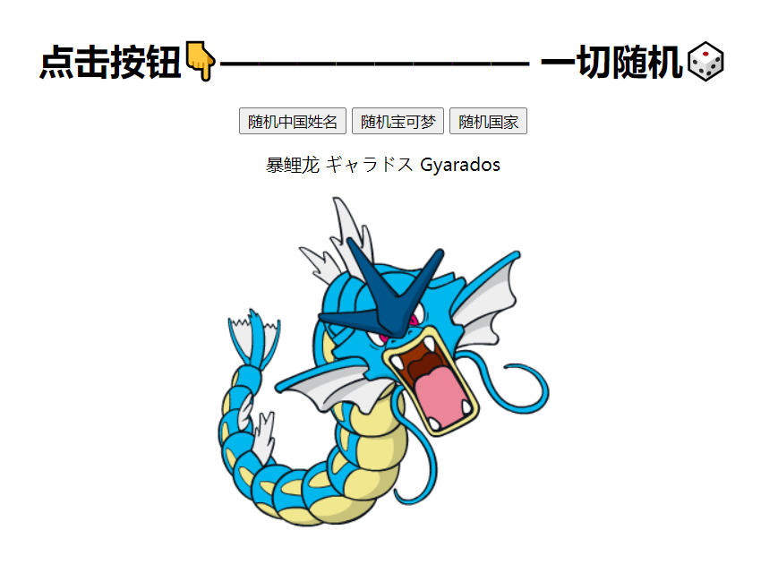

# Random 一切随机

[Sample Demo](<https://tjfish.github.io/Random/>)

目前支持以下随机

- **宝可梦** （如妙蛙种子，带图片）
- 国家 （如中国，带国旗）
- 中国姓名（如张麻子）

## 截图



## 使用方式

```html
<script src='random-name.js'></script>
<script src='random-pokemon.js'></script>
<script src='random-country.js'></script>
<script>
    console.log(RandomPokemon.random()) // 妙蛙种子
    console.log(RandomCountry.random()) //中国
    console.log(RandomChineseName.random())  //张麻子
</script>
```

